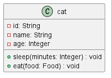
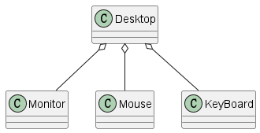
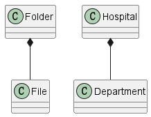
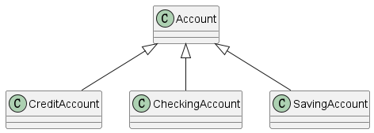
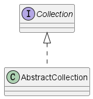

# UML类图

## 类图的最简单构成

分为三个部分

1. 类的名字
2. 类的属性
3. 类的方法、

相关标识符：

| 标志 | 可见性类型 |
| ---- | ---------- |
| +    | public     |
| #    | protected  |
| -    | private    |
| ~    | package    |

## 类之间的关系

### 依赖类关系

#### 依赖关系—Dependency

- 一个类中用到了其他类都算。
- 在java中体现为局部变量、方法参数或对静态方法的调用。
- 使用带虚线的箭头表示

#### 关联关系—Association

- 它使一个类知道另一个类的属性和方法。
- java中的属性（成员变量）。
- 关联关系具有导航性。
- 使用带实线的箭头表示。

#### 聚合关系—Aggregation

- 表示各个部件组成整体，可以分割。

- 如，一台主机有鼠标、显示器、键盘。

- 使用带空心菱形表示，空心菱形一侧代表整体。

  

#### 组合关系—Composition

- 表示各个部件组成的整体，不可分割。强调整体与部分有相同的生命周期

- 如：一个人有眼睛、鼻子、嘴巴。

- 使用实心菱形表示，实心菱形一侧代表整体。

  

  

#### 依赖类关系的强弱程度比较

- 组合>聚合>关联> 依赖

### 非依赖类关系

#### 泛化关系—Generalization

- 表示类与类之间的继承关系。

- 在Java中使用extends关键词表示这种关系。

- 使用实线空心箭头实现表示。箭头一端表示父类。

  

#### 实现关系—Implementation

- 在Java中表示实现关系，关键词implement

- 使用虚线空心箭头表示。箭头一侧表示接口。

  

## 多样性

