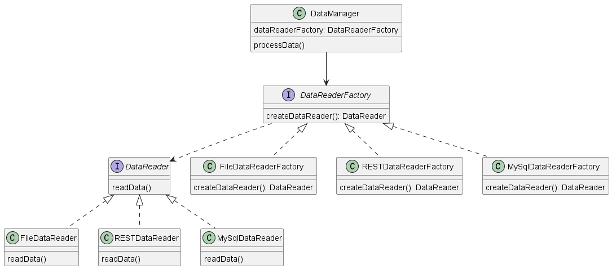

# Factory Method

## 对象创建模式

## 一个简单的需求

从不同数据源读取数据，要求设计`DataManager`类和`DataReader`类，`DataManager`用于处理读取的数据，`DataReader`用于从不同数据源读取数据。

### 不使用任何设计模式

- `DataManager`拥有成员变量`DataReader`，`DataReader`有多种实现。
- 可以在外部使用构造器传入创建好的`DataReader`。

这样一来我们需要在外部自己去`new`对应的`DataReader`，也就是将创建对象的逻辑完全交给用户。是否能屏蔽创建`DataReader`的过程？

### 使用工厂模式

- `DataManager`拥有成员变量`DataReaderFactory`, `DataReaderFactory`有不用的实现，可以创建出不同类型的`DataReader`。
- 我们只需要在外部控制`DataReaderFactory`的类型即可，无需考虑每一个`DataReader`的创建细节。
- `DataManager.processData()`方法调用`dataReaderFactory`的`createDataReader`获得`DataReader`，然后使用`DataReader`读取数据。

## 工厂模式

### 结构组成

- `Product`：定义工厂方法所创建对象的接口。
- `ConcreteProduct`：实现`Product`接口。
- `Creator`：声明工厂方式，该方法返回一个`Product`类型的对象。
- `ConcreteProduct`：实现`Creator`方法，实现创建`Product`的具体逻辑。